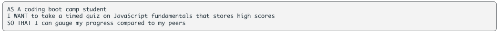
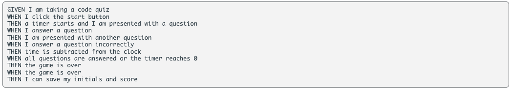

# w4-timed-quiz

Week Four Challenge of the *UOB Full Stack Development Coding Bootcamp* requires students to use Web APIs to create a **timed multiple-choice quiz**. 

We were given a User Story and an Acceptance Criteria as per below:

User Story:

 

Acceptance Criteria:

 

## How I approached the task:

* 

```

```

* 

```

...
}
```

* In between these steps, I also ran **console.log()** to ensure I am getting the result required.

## Screenshot of Deployed Application:

 

## Screenshot of Application Interaction:

 

Re-prompt if (pwLength < 8 || pwLength > 130):

 

 

 

n.b. Users are also asked to confirm uppercase letters and special characters, once all methods are satisfied, a password is generated in the #password text area. If no character types are confirmed, the user is alerted to retry.

 

## URL to Deployed Application:

[Click here](https://priscillaluong.github.io/w3-password-generator/) 

### Final note:

*Any feedback to improve code or areas where I could further implement best practice would be greatly appreciated* 😊